# Notes

## General Config

Add a user WITH name, then you can login from other subnets (otherwise only direct connection).

If it is not really exposed to the internet, this is effectively not a problem.

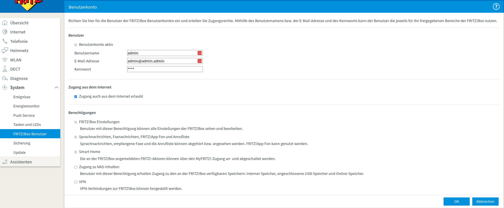

Generally, the Boxes like to select slow speeds for the LAN Ports

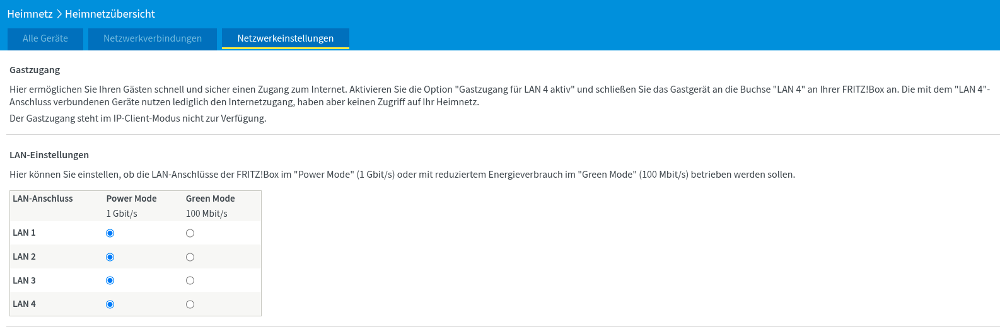

## Client function BEHIND router/modem

For a FritzBox BEHIND a unifi router, configure internet like this:

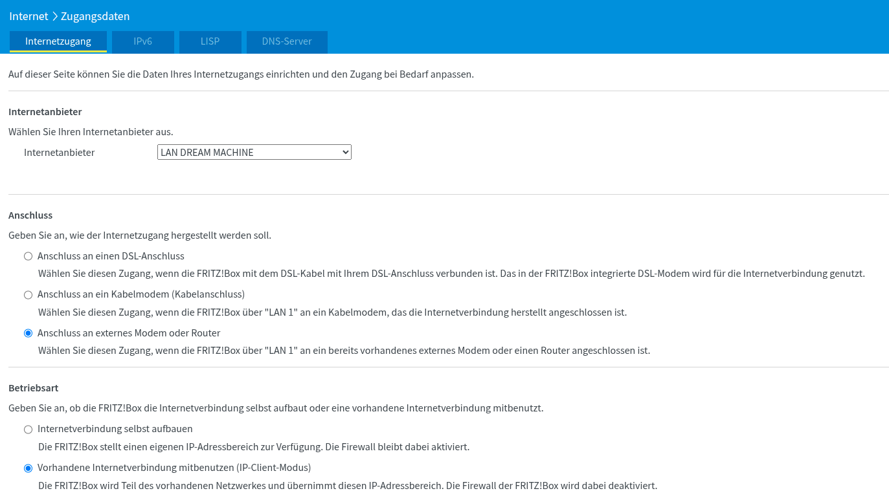

## Telephone

Where to get the [LVN access passwords for telephone and internet](https://kundenportal.lew-highspeed.de/index.php?module=teldata&action=index).

Do the following configs for all Telephone numbers (looks different on later FB)

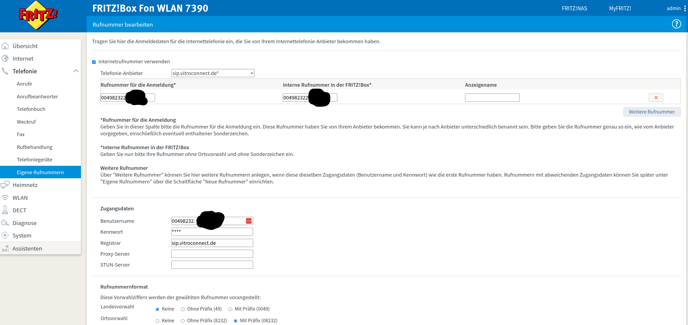
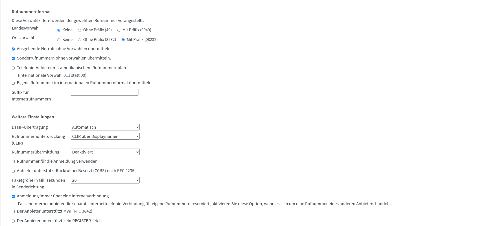
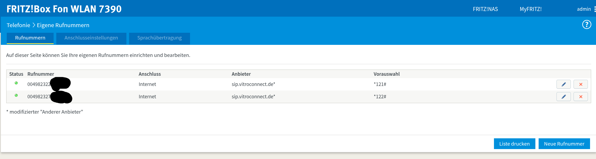

O2 config on Cable modem fritzbox similar, but slightly different:

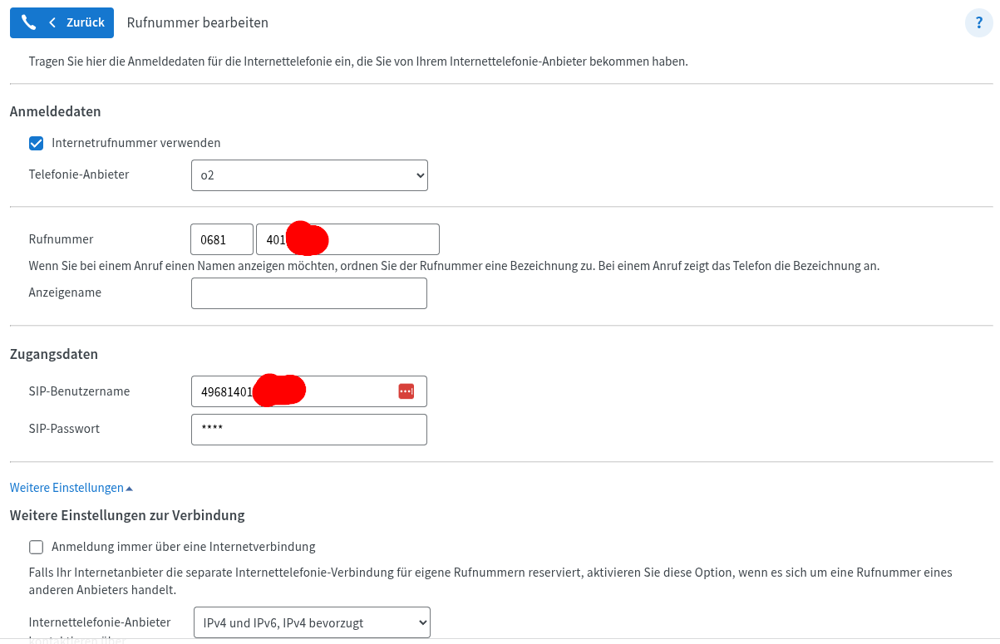

General Settings for telephone (hole Punching is IMPERATIVE for reliable calls)

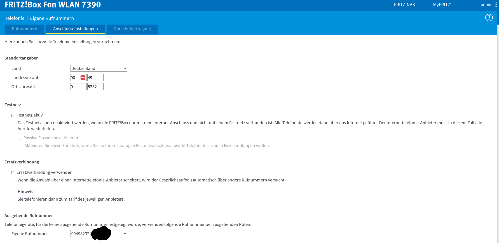
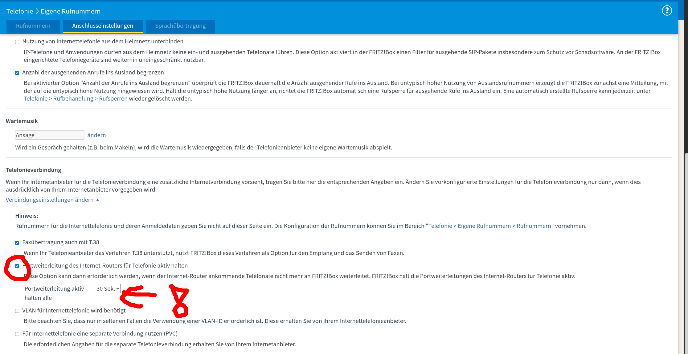

Anrufbeantworter off

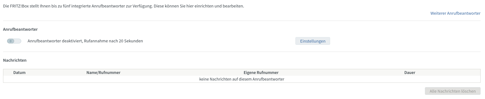

## IPv6 over cable (Fritzbox is a (cable-)modem)

Bridge Mode is not really a exposed thing anymore

[Possible Fix](https://schroederdennis.de/allgemein/fritzbox-bridge-mode-aktivieren-und-genau-erklaert-6591-6660/)

So set the unifi gateway to consume the internet as a user. Set a static ip for the gateway

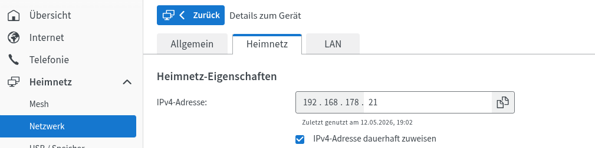

So the public internet connection capabilities need to be forwarded to the router behind the Cable Modem

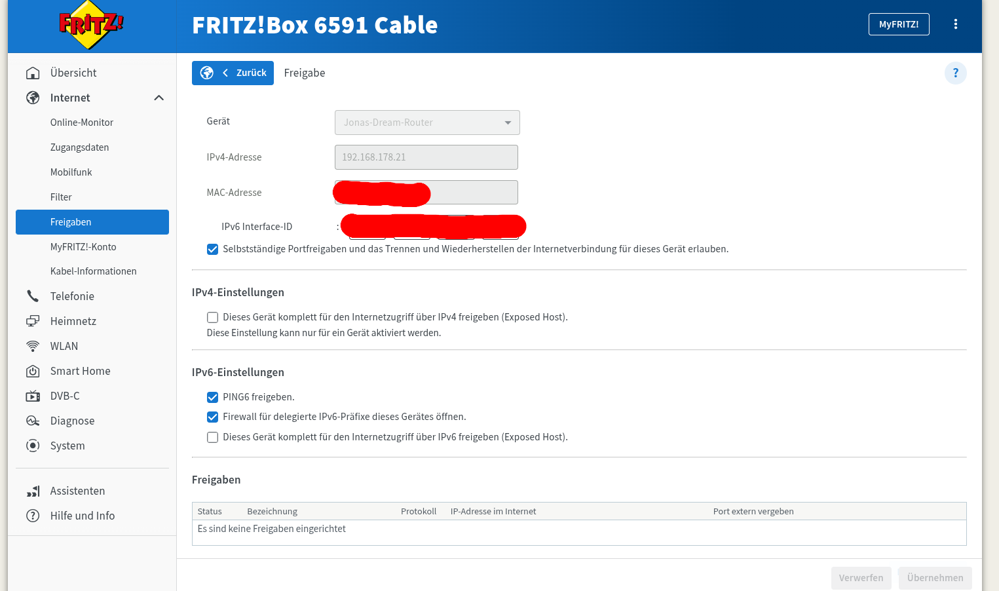

Prefix is assigned, in the case of O2 with only DS-Lite (/64 Prefix -> no real IPv6 delegation, as only one subnet available).

- For DS-Lite Case, use 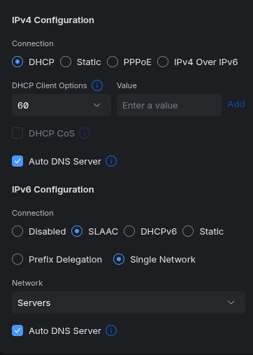
- If you have a bigger prefix, you can 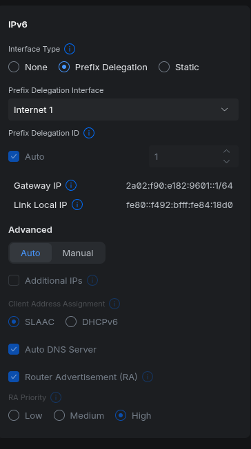 to delegate prefixes

[Prefix lengths](https://v64.tech/t/liste-ipv6-prefix-laenge-unsere-deutschen-provider/2249?page=2)

[Prefixlength IS overwritable with Fritzbox Hack!!!](https://hilfe.o2online.de/dsl%2Dkabel%2Dglasfaser%2Drouter%2Dsoftware%2Dinternet%2Dtelefonie%2D34/56%2Der%2Dpraefix%2Dfuer%2Dipv6%2Dbei%2Do2%2Dkabel%2Dist%2Dmoeglich%2D594598?tid=594598&fid=34) -> Tested and works <3
